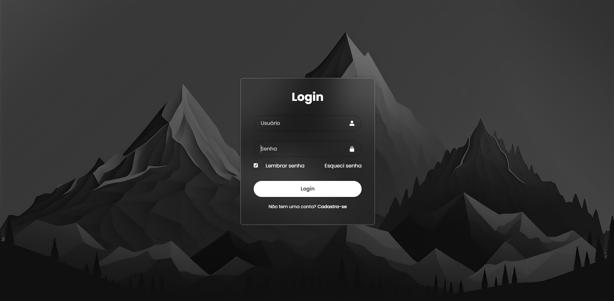

### :gear: Funcionalidadade

O código criado gera uma tela de login.

---
### :dart: Aplicação

Pode ser utilizado para criação de telas de login em websites.

---
### :clipboard: Menu

Esta é a tela de login do usuário, qual perguntará o seu e-mail e senha. Caso o usuário esqueça a senha, haverá uma opção de redefinir a senha.

  

--- 
### 🤖 Linguagens

